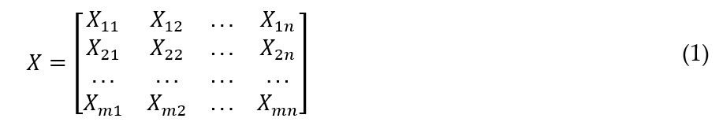
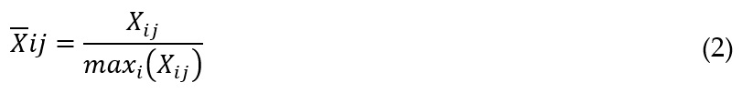
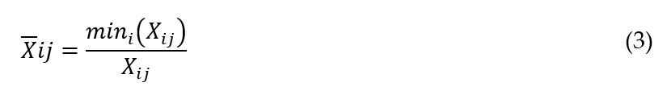
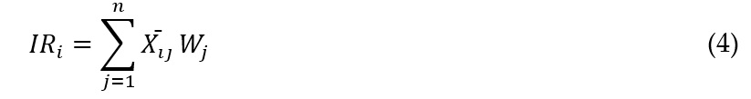
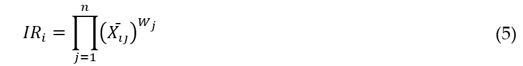
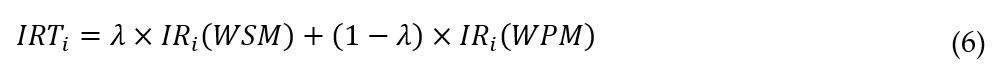
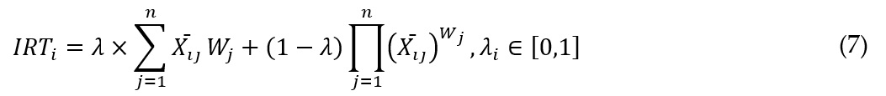

    
# Introduction

The field of Multi-Criteria Decision Making (MCDM) is rapidly expanding, with various methods and implementations being developed, according to Rani et al. (2020).
Gupta et al. (2022) highlight the importance of Operations Research (OR) in decision-making, which has become more complex due to technological advancements and increased uncertainty.
Baryannis et al. (2019) note that organizations use decision-making procedures that consider multiple criteria and data sources to identify and manage operational risks.
This study proposes a solution to the challenges posed by Multi-Criteria Decision Making (MCDM) problems, employing a range of optimization techniques such as AHP, ANP, PROMETHEE, THOR, SAPEVO, TOPSIS, and WASPAS, among others.
While the chosen method, WASPAS, may have limited available literature, it exhibits promising potential for both academic research and practical applications in the market.
The practical efficacy of the aggregate method is demonstrated by Chakraborty and Zavadskas (2014) through its application as an effective MCDM tool to address eight decision-making problems in industrial manufacturing processes.
Additionally, Chakraborty et al. (2015), together with Bhattacharyya, Zavadskas, and Antucheviciene, validate the applicability of WASPAS by optimizing the solution to five common real-time manufacturing problems.
The method's applicability extends to all multicriteria decision processes.
For instance, in the realm of healthcare, Darko and Liang (2022) employ WASPAS to prioritize patient care in the Ghanaian health system.
In a distinct context, a study conducted in India by Singh et al. (2020) utilizes WASPAS to propose an integrated weighting approach for essential factors affecting client satisfaction with the care experience.
The study employed real data collected from the largest health service provider in Calcutta and addressed the demands arising from the sector's economic growth and increased competition in the private healthcare domain in the region.
Soares de Assis et al. (2023) present an application of the proposed approach in a complex decision-making problem faced by the State Military Police in Rio de Janeiro, regarding the optimal acquisition of a helicopter.
The study highlights the various constraints involved, such as cost, operational versatility, and safety criteria, and demonstrates the rigorous application of the proposed method, serving as a valuable resource for validation of the developed systems.
The study aims to provide tangible products to the community by offering a publicly accessible mechanism on the internet that empowers decision-makers to utilize the WASPAS method as a supporting mechanism.
The mechanism is user-friendly and intuitive, and abstracts the computational intricacies involved in the calculation algorithms from the user, thereby eliminating the need for programming or mathematical expertise.

# The WASPAS Method

The article discusses the WASPAS method, which is a multi-criteria decision-making system used to address complex decision-making processes involving extensive sets of alternatives and criteria.
The method combines the Weighted Sum Model (WSM) and Weighted Product Model (WPM) methods to yield higher accuracy.
The article also highlights that the WSM and WPM methods are only applicable to quantitative data and provides caution against employing qualitative data.
The underlying steps of WASPAS, namely WSM and WPM, share initial procedures.
The first step involves constructing the Decision Matrix, as MCDM problems are defined by sets of m alternatives and n criteria.
Consequently, an m-by-n matrix is created, containing known values of the n criteria for each of the m alternatives, as illustrated in equation (1).

*where, X: is the algebraic matrix formed by the values of the set of criteria associated with each of the alternatives under analysis in the study of the MCDM problem; and Xmn is the value of a specific criterion (n) for a specific alternative (m).*

The second step of the WASPAS method involves normalizing the values in the decision matrix to overcome the issue of highly disparate criteria.
Different normalization formulas are used for monotonic cost or benefit criteria, depending on whether higher or lower values are preferred.
For benefit criteria, the normalization process involves dividing the value of each alternative by the maximum value of the set of values for that specific criterion.
The performance values of each alternative with respect to each criterion are normalized, such that each value is divided by the maximum value of that criterion across all alternatives.
This is done for each monotonic benefit criterion and is represented by equation (2).

*where, Xij: represents the normalized value for a specific tuple (alternative, criterion); Xij is the original value that needs to be normalized; maxi(Xij) denotes the largest value within the set of values for a specific monotonic benefit criterion across all alternatives.*

For monotonic cost criteria, the vector of performance values associated with the specific criterion is normalized by dividing each value obtained for the criterion by the smallest value within the set of values.
In this case, the normalization of the alternatives' performance values with respect to the criterion involves applying a function to the vector of values Xij for the jth criterion.
This function divides the minimum value of the criterion's value vector by the value of the ith alternative.
The formula for this normalization process is represented below:

*where, Xij: is the normalized value for a specific tuple (alternative, criterion); Xij is the original value to be normalized; mini(Xij) represents the smallest value within the set of values for a specific monotonic cost criterion across all alternatives, the index i ranges from 1 to m, representing the number of alternatives.*

The WSM and WPM methods differ in determining the best alternatives based on the weighting function, while both assign weights to criteria based on their relative importance determined by the decision maker.
The goal of MCDM methods is to produce a ranked list of alternatives that represents their relative importance.
In the WSM method, the relative importance value for each alternative is obtained by summing the normalized values of the set of criteria assigned to that alternative, denoted by IRi and Wj respectively, see equation (4):

*where, IRi: is the relative importance of alternative i obtained by the sum of normalized values Xij weighted by the arbitrated weight of criterion j Wj with j ranging from 1 to n, where n is the number of criteria in the problem.*

In the WPM method, normalized values of the criteria are raised to the power of the weight assigned to the relative importance of the jth criterion, as shown in the weights vector, represented by equation (5):

*where, IRi: is the relative importance of alternative i obtained by the product of the normalized values Xij raised to the arbitrated weight of the criterion j Wj with j ranging from 1 to n, where n is the number of criteria in the problem.*

The WASPAS method combines the relative importance of the WSM and WPM methods by introducing a lambda parameter between 0 and 1.
This parameter is used to determine the Total Relative Importance by combining the weighted relative importance of WSM and WPM.
The total relative importance is calculated as the sum of lambda multiplied by the relative importance from the WSM method, and the complement of lambda multiplied by the relative importance from the WPM method.
The lambda value determines the emphasis placed on the WSM and WPM relative importance, with a value of 1 emphasizing WSM and a value of 0 emphasizing WPM.

*where IRTi is the total relative importance of alternative i, obtained by the WASPAS method; IRi(WSM) is its relative importance obtained by the WSM method and IRi(WPM) is its relative importance obtained by the WPM method; λ (Lambda) is a value ranging from 0 to 1.*

By substituting the weighted sum (WSM) and weighted product (WPM) formulas, we arrive at equation (7), which is commonly encountered in relevant technical literature:

*where IRTi is the total relative importance of alternative i, obtained through the WASPAS method, is calculated using the formula above, where the lambda factor multiplies the sum indicated in equation (4), and its complement (1-λ) multiplies the product indicated in equation (5).*

#Computational tools

The R language serves as the foundation for all the development in this work.
R is an open-source language that was created in 1993 for statistical analysis, data mining, machine learning, and database exploration.
It benefits from numerous packages available through the CRAN repository and is recognized as one of the most popular languages for statistical analysis, statistical graphing, and data science projects.
R's success is due to its extensibility, robustness, versatility, and the active support from a large community of volunteers who contribute to frequent updates of the language.
The language is currently in version 4.2.3, with version 4.3.0 scheduled for release on April 21, 2023, driven by a core group of developers supported by contributions from the community.
This community is primarily manifested through the "R Foundation," which holds the copyright and oversees the management of the R software and documentation.
The "R Foundation" is a non-profit organization that manages the R software and documentation, with the goal of supporting the R Project and promoting innovation in statistical computing.
The foundation oversees the ongoing development of R through advancements in statistical and computational research software and serves as a reference point for those looking to engage with the R development community.
It also organizes meetings and conferences in the field of statistical computing.
This study heavily relied on RStudio IDE, which is free and compatible with multiple operating systems.
RStudio was developed by Posit Software PBC, a prominent organization in the R community that offers valuable resources.
Posit Software PBC is a Public Benefit Corporation (PBC) with B-Corp certification, meaning it prioritizes both profit and societal well-being.
The study also utilized posit.cloud, an online environment similar to RStudio IDE but with usage limitations.
Users must create an account to access their designated work area.
The web service developed in this study is hosted on shinyapps.io, which offers a free membership plan with limitations on app hosting and availability.
Paid plans offer extended availability, and additional charges may apply for exceeding allocated hours.
To access the service, users must create an account, and the platform offers resources for hosting web applications developed in R using the shiny package.
Publishing the application involves utilizing the available functionalities within IDEs, which offer a streamlined publishing option specifically designed for Shiny applications.
The project's primary application file, typically named app.R, must reference the Shiny package, define the user interface, establish the application's logic, and initiate code execution.
The application can be run in a browser or within the IDE's runtime viewer, which also provides the capability to command the publication of the application on the web.
GitHub is a successful internet company that offers a collaborative software version control platform based on Git, serving over 100 million developers across more than 4 million organizations and hosting over 330 million repositories.
Microsoft acquired GitHub in October 2018.
GitHub is integrated with RStudio and widely adopted within the IT community, making it a suitable platform for making the software developed in this project accessible to diverse communities.
The project's R library and Shiny project code are publicly available in a repository on GitHub.
Significant benefits come with building a software package, such as componentization, code reuse, context isolation, and standardized design, leading to improved code readability and an engaged community.
The implementation of this project was in the R language, and the package was promoted through CRAN, a vast repository of R packages supported by a global network of FTP servers or mirrors.
CRAN undergoes a rigorous certification process for all packages to ensure compliance with strict standards, and contributors must adhere to the repository's policies for package submission.
The development process of the package followed a prototyping approach, which included requirements analysis, package structure design, code implementation, testing, documentation creation, package submission to CRAN, feedback addressing, and continuous package improvement.
Communication was ad hoc, based on the availability of the advisor and student and the CBT project's needs, and activities overlapped and proceeded in parallel.
